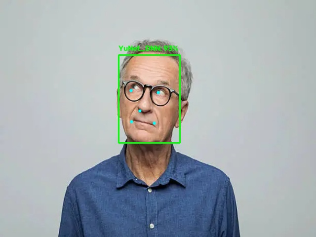
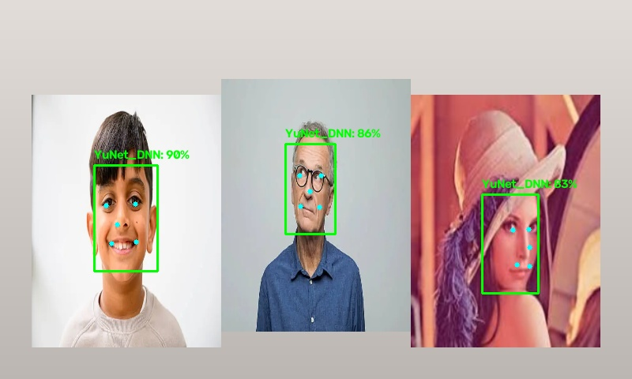
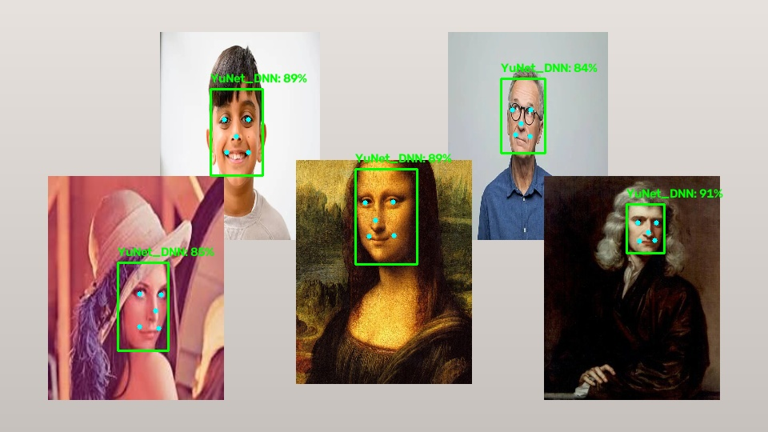
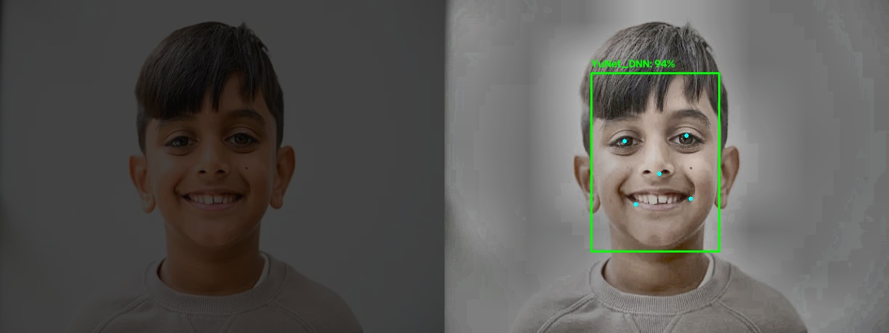
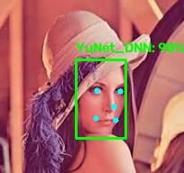

# 👤 Human-In-The-Loop (HITL) Multi-Agent SDLC Platform: Face Detection

> **An enterprise-grade AI software development platform where Human Approval is an active code guard at every single engineering milestone, featuring 7 SDLC Governance Agents, 5 Algorithmic Face Detection Workers, real-time visual feedback, and per-task QA certification.**

[](https://share.streamlit.io/)
[](https://python.org)
[](https://opencv.org)
[](#-automated-testing--verification)
[](LICENSE)

---

## 📸 Sample Visual Detections Gallery

Here is our deep-learning face detection pipeline in action across real-world enterprise scenarios:

| **Single Frontal Portrait** | **Multi-Person Social Scene** |
|:---:|:---:|
|  |  |
| *Single face detected with 5 facial landmarks (eyes, nose, mouth edges)* | *Multiple faces detected simultaneously with confidence scores* |

| **Office Team Meeting (5 Faces)** | **Auto-Fix: Low-Light Enhancement & Detection** |
|:---:|:---:|
|  |  |
| *High-density multi-face detection in varying poses and angles* | *Left: Underexposed shadow photo ➔ Right: CLAHE auto-brightened & detected* |

| **Benchmark Verification Photo** |
|:---:|
|  |
| *Standardized benchmark image evaluated across all 5 algorithmic tasks* |

---

## 💡 What Is This Platform? (In Plain English)

In traditional AI software development, two major problems happen every day:
1. **The "Black Box AI" Trap:** If AI agents run autonomously without human supervision, they can hallucinate wrong requirements, introduce subtle memory leaks, or push broken algorithms into production.
2. **Late Testing Disasters:** In traditional teams, testing only happens at the very end. Finding a critical bug just before release causes expensive delays and rewrites.

### Our Solution:
This platform introduces an **Active Human-In-The-Loop (HITL) Software Development Lifecycle (SDLC)**:
* 🔒 **The Code Literally Halts at Every Stage:** Execution completely pauses at each milestone. The next agent or algorithm **cannot run** until a human engineer inspects the deliverable and clicks **`[Approve]`**.
* 🔁 **Real-Time Remediation Loop:** If you click **`[Reject]`**, the AI agent does not crash — it prompts you for feedback (e.g., *"Improve brightness for FR-02"*), autonomously refactors the code or requirements, and presents a **Previous vs. Current** side-by-side comparison.
* 🛠️ **Task-by-Task QA Certification:** Rather than waiting until the end, every single algorithmic worker built by the Developer is tested in real time by the QA Engineer with an instant, human-readable **QA Test Report Card**.

---

## 🏛️ Two-Tier Architecture Overview

```text
┌────────────────────────────────────────────────────────────────────────────────────────┐
│                        TIER 1: 7 SDLC GOVERNANCE AGENTS                                │
│                                                                                        │
│   [1. PM Coordinator]    ──────► 👤 HUMAN GATE 1: Approve Functional Requirements?    │
│            │                                                                           │
│            ▼                                                                           │
│   [2. System Architect]  ──────► 👤 HUMAN GATE 2: Approve Architecture Blueprint?     │
│            │                                                                           │
│            ▼                                                                           │
│   [3. Tech Lead Agent]   ──────► 👤 HUMAN GATE 3: Approve 5-Task Roadmap?              │
│            │                                                                           │
│            ▼                                                                           │
│   ┌──────────────────────────────────────────────────────────────────────────────┐     │
│   │                 4. DEVELOPER + QA TASK-BY-TASK APPROVAL CYCLE                │     │
│   │                                                                              │     │
│   │   • Task 1: Streamer   ──► QA Test Report 1 (3/3 Pass) ──► 👤 HUMAN GATE 4.1 │     │
│   │   • Task 2: Enhancer   ──► QA Test Report 2 (3/3 Pass) ──► 👤 HUMAN GATE 4.2 │     │
│   │   • Task 3: Detector   ──► QA Test Report 3 (4/4 Pass) ──► 👤 HUMAN GATE 4.3 │     │
│   │   • Task 4: Inspector  ──► QA Test Report 4 (3/3 Pass) ──► 👤 HUMAN GATE 4.4 │     │
│   │   • Task 5: Pipeline   ──► QA Test Report 5 (3/3 Pass) ──► 👤 HUMAN GATE 4.5 │     │
│   └──────────────────────────────────────┬───────────────────────────────────────┘     │
│                                          │ (All 5 tasks approved)                      │
│                                          ▼                                             │
│   [5. Code Reviewer]     ──────► 👤 HUMAN GATE 5: Approve Security & Code Audit?       │
│            │                                                                           │
│            ▼                                                                           │
│   [6. QA Regression]     ──────► 👤 HUMAN GATE 6: Approve Master QA Certification?     │
│            │                                                                           │
│            ▼                                                                           │
│   [7. Watchdog Agent]    ──────► 👤 FINAL HUMAN GATE: Authorize Production Launch!     │
└────────────────────────────────────────────────────────────────────────────────────────┘
```

---

## 🤖 The 7 SDLC Governance Agents

Each agent represents a dedicated software engineering discipline:

| Stage | Agent Role | Deliverable | Governance Gate |
|:---:|:---|:---|:---|
| **1** | **Product Manager (PM)** | 5 Functional Requirements (`FR-01` to `FR-05`) with acceptance criteria | Verify business scope and latency SLAs (<150ms) |
| **2** | **System Architect** | 4-Component Architecture Blueprint & ONNX Deep Learning pipeline | Verify modular decoupling & memory isolation |
| **3** | **Tech Lead** | 5-Task Engineering Roadmap with input/output contracts | Verify algorithmic implementation milestones |
| **4** | **Developer + QA** | 5 Algorithmic Workers + 5 automated per-task QA Test Reports | Inspect code evidence & test pass rates (100%) |
| **5** | **Code Reviewer** | Security, thread-safety, and memory leak audit report | Ensure zero memory leaks and clean architecture |
| **6** | **Master QA** | Full 7-stage regression verification test suite | Confirm end-to-end integration across all modules |
| **7** | **Production Watchdog** | Final deployment packaging, health monitoring, and release sign-off | Final human authorization to deploy to production |

---

## 🔬 The 5 Algorithmic Face Detection Workers

Implemented under `algorithmic_agents/` and verified individually:

1. **`worker_1_streamer.py` (Face Streamer & Ingestion):**
   * Ingests local camera/video frames or generates synthetic 1080p test buffers with verified 3-channel RGB integrity.
2. **`worker_2_enhancer.py` (Adaptive Enhancer & Auto-Fix):**
   * Uses Lab-color space **CLAHE (Contrast Limited Adaptive Histogram Equalization)**, gamma curve brightening, and unsharp masking to rescue dark, shadowy, or blurry photos.
3. **`worker_3_detector.py` (YuNet Deep Learning Detector):**
   * Executes OpenCV's **YuNet ONNX deep neural network** (`models/face_detection_yunet.onnx`). Detects faces with bounding boxes and predicts **5 landmark coordinates** (right eye, left eye, nose tip, right mouth corner, left mouth corner) with sub-pixel precision.
4. **`worker_4_inspector.py` (Quality & Pose Inspector):**
   * Analyzes facial sharpness via Laplacian variance, measures ambient illumination, and computes yaw pose classification (`FRONTAL`, `PROFILE_LEFT`, `PROFILE_RIGHT`).
5. **`worker_5_orchestrator.py` (Multi-Agent End-to-End Pipeline):**
   * Orchestrates workers into an autonomous, closed-loop diagnostic and healing pipeline running in **< 150ms SLA**.

---

## 🚀 Quick Start: How to Run Locally

### Prerequisites
* Python 3.10 or 3.11
* Git

### 1. Clone the Repository
```bash
git clone https://github.com/pankajatd/face-detection-hitl-sdlc.git
cd face-detection-hitl-sdlc
```

### 2. Create a Virtual Environment & Install Dependencies
```bash
# Windows
python -m venv venv
.\venv\Scripts\activate

# macOS / Linux
python3 -m venv venv
source venv/bin/activate

# Install required packages
pip install -r requirements.txt
```

### 3. Launch the Interactive Web Dashboard
```bash
# Windows 1-click launcher:
run_dashboard.bat

# Or direct command:
streamlit run dashboard.py
```
> The dashboard will automatically launch in your browser at **`http://localhost:8501`** (or `8509`).

### 4. Or Run the Interactive Terminal CLI
```bash
# Windows 1-click launcher:
run_cli.bat

# Or direct command:
python run_interactive_sdlc.py
```

### 5. Run the Automated Verification Suite
```bash
# Windows 1-click launcher:
run_all.bat

# Or direct command:
pytest -v
```

---

## ☁️ How to Deploy to Streamlit Cloud (Step-by-Step)

You can deploy this platform to the web for free using **Streamlit Community Cloud**:

1. **Sign In to Streamlit Cloud:**
   * Go to [https://share.streamlit.io](https://share.streamlit.io) and sign in with your GitHub account.
2. **Create New App:**
   * Click the **"New app"** button in the top right.
3. **Configure Deployment Settings:**
   * **Repository:** `pankajatd/face-detection-hitl-sdlc`
   * **Branch:** `main`
   * **Main file path:** `dashboard.py`
4. **Deploy:**
   * Click **"Deploy!"**
   * Streamlit Cloud will automatically install dependencies from `requirements.txt` and launch your live interactive platform!

---

## 🧪 Automated Testing & Verification

The platform includes full unit and integration test coverage:

```text
============================= test session starts =============================
platform win32 -- Python 3.11.9, pytest-9.1.1
rootdir: C:\Users\panka\...\face_detection_hitl_sdlc
collected 9 items

tests/test_algorithmic_workers.py::test_worker_1_streamer PASSED         [ 11%]
tests/test_algorithmic_workers.py::test_worker_2_enhancer PASSED         [ 22%]
tests/test_algorithmic_workers.py::test_worker_3_detector PASSED         [ 33%]
tests/test_algorithmic_workers.py::test_worker_4_inspector PASSED        [ 44%]
tests/test_algorithmic_workers.py::test_worker_5_orchestrator PASSED     [ 55%]
tests/test_per_task_qa.py::test_qa_evaluator_all_tasks PASSED            [ 66%]
tests/test_sdlc_hitl.py::test_hitl_initialization PASSED                 [ 77%]
tests/test_sdlc_hitl.py::test_hitl_rejection_blocks_progression PASSED   [ 88%]
tests/test_sdlc_hitl.py::test_hitl_full_approval_cycle PASSED            [100%]

============================== 9 passed in 0.91s ==============================
```

---

## 📂 Repository File Structure

```text
face-detection-hitl-sdlc/
├── dashboard.py                   # Full interactive Streamlit Web Approval Dashboard
├── run_interactive_sdlc.py        # Terminal CLI Approval Runner
├── requirements.txt               # Lightweight runtime dependencies (Streamlit, OpenCV, etc.)
├── packages.txt                   # Linux container packages for Streamlit Cloud
├── run_dashboard.bat              # 1-Click launcher for web dashboard
├── run_cli.bat                    # 1-Click launcher for terminal CLI
├── run_all.bat                    # 1-Click launcher for pytest suite
│
├── sdlc_engine/                   # Core HITL State Machine & Quality Engines
│   ├── state.py                   # State schema, stage constants & audit log
│   ├── controller.py              # Strict Human Gatekeeper & remediation guard
│   └── qa_evaluator.py            # Automated per-task QA Test Report generator
│
├── sdlc_agents/                   # Tier 1: 7 SDLC Governance Agents
│   ├── pm_agent.py                # Stage 1: Product Manager (Requirements Spec)
│   ├── architect_agent.py         # Stage 2: System Architect (Architecture Blueprint)
│   ├── tech_lead_agent.py         # Stage 3: Tech Lead (Task Breakdown Roadmap)
│   ├── developer_agent.py         # Stage 4: Developer Agent (Executes Tasks 1..5)
│   ├── qa_agent.py                # Stage 4: QA Engineer (Per-Task Test Reports)
│   ├── reviewer_agent.py          # Stage 5: Code Reviewer & Safety Auditor
│   ├── qa_system_agent.py         # Stage 6: Master QA Regression Suite
│   └── watchdog_agent.py          # Stage 7: Production Watchdog & Final Sign-Off
│
├── algorithmic_agents/            # Tier 2: 5 Algorithmic Face Detection Workers
│   ├── worker_1_streamer.py       # Task 1: Ingestion & Buffer Streamer
│   ├── worker_2_enhancer.py       # Task 2: Adaptive Lighting & Blur Enhancer
│   ├── worker_3_detector.py       # Task 3: YuNet Deep Learning Face Detector
│   ├── worker_4_inspector.py      # Task 4: Quality & 5-Point Pose Inspector
│   └── worker_5_orchestrator.py   # Task 5: End-to-End Multi-Agent Pipeline
│
├── models/
│   └── face_detection_yunet.onnx  # YuNet Deep Neural Network ONNX model weights
│
├── test_images/                   # Benchmark photos & diverse testing scenes
├── docs/sample_detections/        # Generated sample face detection galleries
└── tests/                         # Pytest test suites (100% passing)
```

---

## 📜 License

This project is licensed under the MIT License - see the [LICENSE](LICENSE) file for details.
